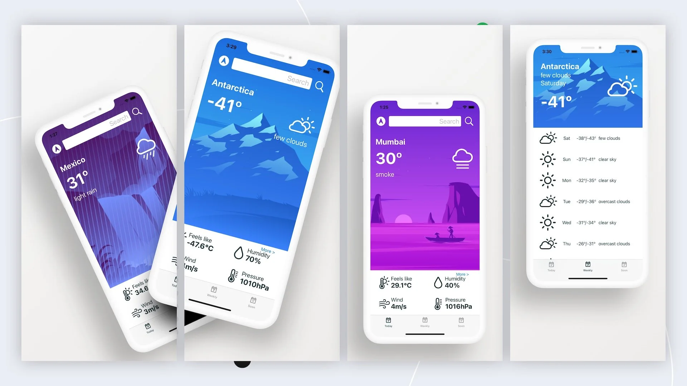

# GoodWeatherApp

# Description
This is an app for getting weather information on your phone and Apple Watch. It is possible to search for a city, receive information about weather conditions for the current moment or week. Uses the API of the openweather.org service.

## Built With
- Swift
- UIKit
- MVC
- Alamofire
- CoreLocation
- WatchKit
- WatchConnectivity
- WebKit

## Author
**Evgenii Kolgin**

- [Profile](https://github.com/Colgates "Evgenii Kolgin")
- [Email](mailto:kolgin.ev@gmail.com?subject=Hi% "Hi!")
- [Website](https://evgeniikogin.ru "Welcome")

## 🤝 Support
Contributions, issues, and feature requests are welcome!
Give a ⭐️ if you like this project!
